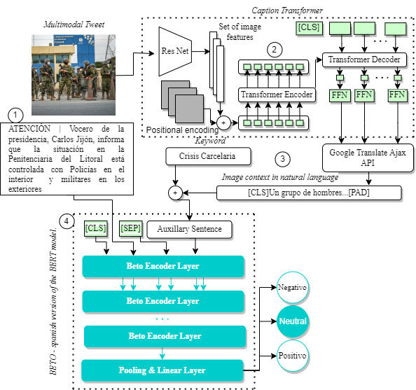

# Spanish Pre-Trained CaTrBETO Model for Sentiment Classification in Twitter 
[Arianna Armijos](https://github.com/Ariannx), [Jose Llumiquinga](https://github.com/JoseLuis96001), [Kevin Contreras](https://github.com/KevinL97), [Sebastían Lalvay](https://github.com/leolalvay), [Steven Allauca](https://github.com/sgag26), [Washington Pijal](https://github.com/Daniel-Qubit220)

Machine Learning Course, School of Mathematical and Computational Science - Yachay Tech University

---

[](https://github.com/Daniel-Qubit220/CaTrBETO)

[ <a href="https://colab.research.google.com/drive/1gTLMjrUAmKWmCZ6k1yDDb4cFSoHkl8ui?usp=sharing"></a>]("https://colab.research.google.com/drive/1gTLMjrUAmKWmCZ6k1yDDb4cFSoHkl8ui?usp=sharing")

This repository is the official implementation of CaTrBETO: Spanish Pre-Trained Model for Sentiment Classification in Twitter


# Running The Code
## Data 
The database used in this paper can be found in the `data/` data. The images are not necessary to run the code, but They can be found [here](https://drive.google.com/drive/folders/1WFQvL3HsOWL4ODiUDj0C6SPEuJP5lz65?usp=sharing).

## Generating Captions
The captions for replicating the results are already in the `data/` folder. However, the caption transformer can be found in the [CATR](https://github.com/saahiluppal/catr/) repository. Once the captions are gotten, run `GoogleTranslateAjaxAPI.py`.

## Training \& Evaluation

To train and evaluate the CaTrBETO go to `CaTrBETO_Train.py`  and define the correct paths to the `data/` directory in the following lines.


```python
train_tsv = "/path/to/tsv/file"
dev_tsv = "/path/to/tsv/file"
test_tsv = "/path/to/tsv/file"
captions_json = "/path/to/JSON/file"
```


## Results 


| Tweet             | Target   |  Label | Prediction  | Label-Spanish  |  Prediction-Spanish   |
| :---      | :---:        |        :-----:         |     :---:      |     :---:      |     :---:      |
| Me siento orgulloso de comunicar que, el día de mañana he sido invitado a la comisión de seguridad de la @AsambleaEcuador con la finalidad de exponer propuestas de reforma, sobre la crisis carcelaria que vive el país. El cambio se logra aportando todos. #crisiscarcelaria	 |  crisiscarcelaria | 2 | 2 | positivo | positivo | 
| Y así los hubieran atrapado, seguro los habrían soltado por falta de leyes más estrictas! Cada vez que llamamos a la @PoliciaEcuador y no atienden siempre se excusan diciendo que los patrulleros ya no se abastecen solo con el UPC de este sector.#Inseguridad #Tumbaco #puembo | Inseguridad | 1 | 0 | neutral | negativo |
| #Historiasdelacomunidad Hay sectores que han permanecido en el abandono según indican los habitantes de varios puntos de la ciudad. La #inseguridad es preocupante pues la #delincuencia no permite a los ciudadanos circular con tranquilidad. Solicitan más resguardo policial	 | delincuencia | 0 | 0 | negativo | negativo |
| #Inseguridad Asaltaron las cabinas de cobro en el peaje en la Vía al Pan... 6 delincuentes a bordo de una furgoneta color blanco irrumpieron en el lugar con sus armas de fuego y hasta tenían un combo para destrozar los vidrios... No se conoce monto del botín. Noticia en proceso.	 | Inseguridad | 0 | 0 | negativo | negativo |
| Cerrada la vía a Daule a la altura de la #PenitenciariaDelLitoral en #Guayaquil. #SucreEnLaNoticia	 | PenitenciariaDelLitoral | 1 | 1 | neutral | neutral |
| Encuentran a un privado de libertad ahorcado. La Policía comienza el conteo de fallecidos por los amotinamientos. #CrisisCarcelaria	 | CrisisCarcelaria | 0 | 0 | negativo | negativo |


